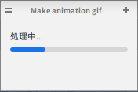
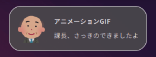
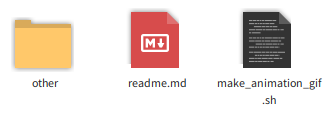

# MOVIE2ANIMATION_GIF
## これは何？
動画ファイルからアニメーションgifファイルを作成します。  
デフォルトでは5fps, 横幅600pxに調整します。  
- 進行状況をプログレスバーで表示  
  
- 終了を音と通知ダイアログでお知らせ  
  
# Installation
新しいフォルダを作り、そこにファイルを置いて下さい。  
  
`git clone`すれば初めからこの様になります。  
`make_animation_gif.sh`に実行権限を与えて下さい。
# Usage
`make_animation_gif.sh`をダブルクリックするか仮想端末から起動して下さい。
# Requirements
- ffmpeg
- imagemagick
- pngquant
- paplay
- notify-send
- zenity
# Setting
## Parameters
標準では以下の設定になっています。
- FPS=5
  - ffmpeg
- WIDTH=600
  - mogrify
- POSTERIZE=4
  - pngquant, 削減ビット数最大値
- QUALITY=0-5
  - pngquant, 最低0-100  
  
もし設定を変えたい場合はソースの以下の部分を変更して下さい。  
```bash
# 初期設定 ###########
FPS=5
WIDTH=600
POSTERIZE=4
QUALITY=0-5
# ####################
```
## Icon
man_55.pngは[いらすとや様該当ページ](https://3.bp.blogspot.com/-1LXBe86Lrs8/Vf-artgLU6I/AAAAAAAAyJE/i5zNuMDWXWo/s800/icon_business_man13.png)から個別にダウンロードして下さい。
# Reference
- [pngquant](https://pngquant.org/)公式
- [Icon Naming Specification](https://specifications.freedesktop.org/icon-naming-spec/icon-naming-spec-latest.html)
- [【Zenn】github用のアニメーションgifまわりあれこれ](https://zenn.dev/ykesamaru/articles/52653d248e854d)
- [【じーろぐ】減色ツールPngquantの仕組みと最適パラメータを探る](https://zlog.hateblo.jp/entry/2019/05/05/pngquant)
# Author
yKesamaru
# License
MIT license  
  
それ以外のライセンス  
- Positive.ogg: [Nathaniel McCallum](https://launchpad.net/ubuntu/bionic/+source/ubuntu-sounds/+copyright)
  - Creative Commons Attribution-ShareAlike License
  - /usr/share/sounds/ubuntu/notifications/  